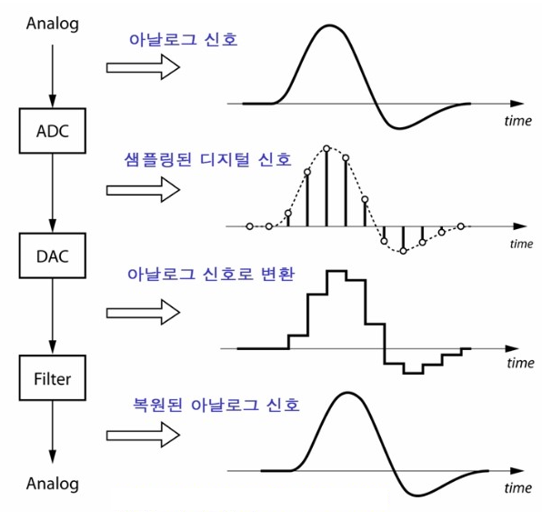
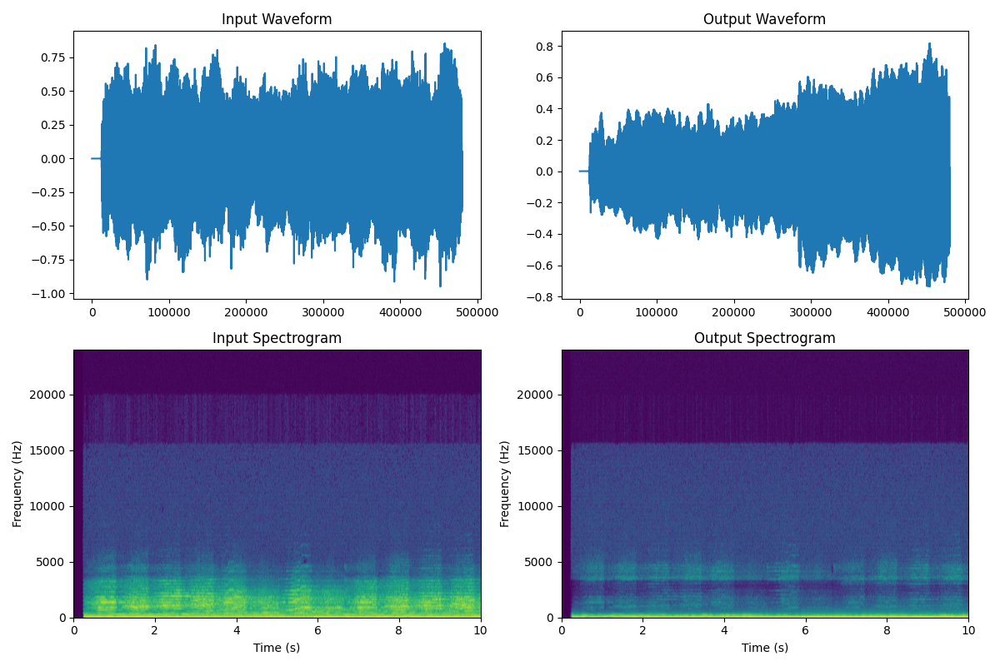

## Electrical Engineering

### Core Focus
- Primarily focused on **electric power**
- Large voltage, large current, and energy transmission

---

## Electronic Engineering

### Core Focus
- Primarily focused on **information processing**
- Small voltage, small current, and signal manipulation

### Examples
- Smartphone processors
- CPU / GPU
- Sensors
- Wireless communication systems

### Major Fields
- Semiconductors
- Embedded systems
- Communications
- **Digital Signal Processing (DSP)**
- IC / SoC design

### Characteristics
- Low power / high integration
- Signal and data processing
- **Strong connection with computers and AI**

---

## Sound as a Signal

Sound is a type of signal.

In the real world, sound is delivered through vibrations of air pressure.
These vibrations travel as continuous analog waves.

Computers, however, cannot directly process continuous physical signals.
Therefore, the analog sound signal must first be converted into a digital form.

This process is called **sampling**.

During sampling, the continuous-time signal \(x(t)\) is measured at discrete time intervals. \(x[t]\)

The sampled values are then represented as numbers, allowing computers and digital systems to process audio using DSP algorithms.

After digitization, various operations become possible:
- Noise reduction
- Audio compression
- Voice recognition
- Music processing
- **Signal filtering**

---

## Today we use DSP techniques to suppress vocals from music.

### Core Idea

Vocals mainly occupy specific frequency regions.

To reduce vocals, we:

1. Convert the audio into the frequency domain using STFT
2. Detect the frequency range where vocals are strong
3. Suppress those frequencies
4. Reconstruct the audio signal

---

### Step 1 — Sampling

The original analog sound wave is sampled into discrete-time data.

---

### Step 2 — STFT

We applied STFT (Short-Time Fourier Transform).

---

### Step 3 — Frequency Masking

We created a mask to suppress vocal-dominant frequencies.

- Vocal frequency energy becomes weaker

---

### Step 4 — Filtering

The mask was applied to the spectrum.

Unwanted frequency components are attenuated while preserving other parts of the music signal.

---

### Step 5 — ISTFT Reconstruction

We reconstructed the processed signal back into the time domain.

The processed audio can now be played back as sound.

